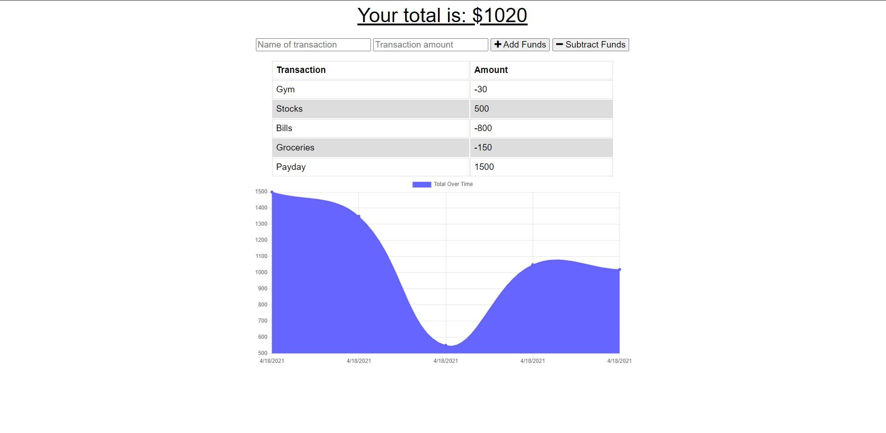
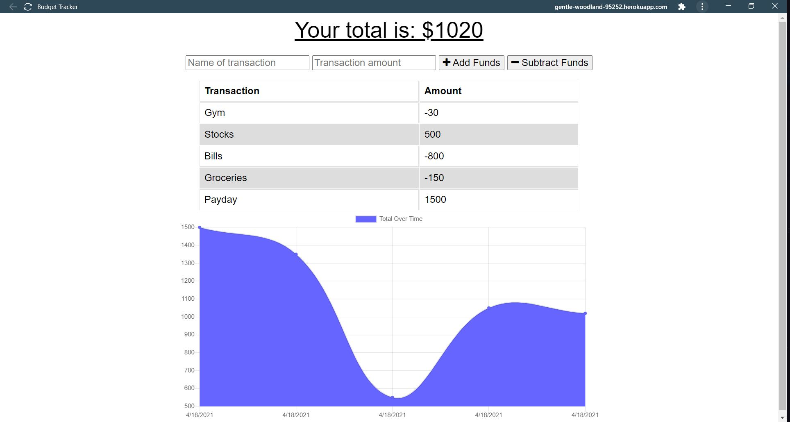

# ProgressiveBudgeting

A PWA (Progressive Web Application) for budgeting both online and offline.
## Link to Deployed Application 🔗

_https://gentle-woodland-95252.herokuapp.com/_

## Table of Contents

1. [Project Description](#project-description)
2. [What to Expect From the Application](#What-to-Expect-From-the-Application)
3. [Tech Stack](#Tech-Stack)
4. [Installation Instructions](#Installation-Instructions)
5. [Goals for Deployment](#Goals-for-Deployment)
6. [Screenshots](#Screenshots)

## Project Description 

The purpose of this project is to take a web application that is fully functional online, and convert it to a Progressive Web Application (PWA). By definition, a PWA has offline functionality that allows the user to still use the main function of the app while their machine is not connected to the internet.

Another feature of this PWA is that it has installability, meaning that the user can install the app to their desktop and use the app outside of their browser. This is 

## What to Expect From the Application

Budgeting is an important aspect in our daily lives, as we should always be aware of our cash-flow. Very important decisions should be made with the consideration of your cash-flow; do you have enough money to go out on an expensive date? How many more checks will need to come in before you can take your dream vacation? With the Progessive Budgeting app, you can easily track your current amount of cash on-hand after submitting your transactions, with a nice visual display to add!

An important feature of this application is that it can be installed both onto the desktop and on mobile, and most interestingly enough, can function offline! This is game changing for a web application, as it doesn't have to be primarily web-based anymore. So you can take your budgeting wherever you may be, whether it's in the jungle, on a cruise in the middle of the ocean, or in the grocery store!

## Tech Stack

* Front-end: CSS3/HTML5
* Front-end/back-end logic: Javascript
* Database: MongoDB
* ODM: Mongoose 
* Server (local): Express.js via Node.js

## Installation Instructions

To install this application, you can clone this repo onto your local machine to obtain the necessary files. When not deployed to Heroku, this application uses MongoDB locally, in which the connection is already set up in the server.js file. No additional environment variables needed! MongoDB will need to be installed on your machine for this to work properly.

Ensure to run `npm install` in your terminal to install the required packages. If you have Nodemon installed, you can run `npm run watch` to make the application live on your local machine.

## Goals for Deployment

- [x] When a user inputs a transaction name and amount, they can use buttons to add or subtract that amount
- [x] When the user adds/subtracts a transaction, the data is saved to a database and data is maintained
- [x] Upon submitting a transaction, the graph will automatically be updated to show the new change
- [x] When turning the network off, the application can still submit transactions and function normally
- [x] Upon turning the connection back on, all new transactions will be stored into the database
- [x] The application will be able to be installed onto the desktop for further offline functionality
## Screenshots

